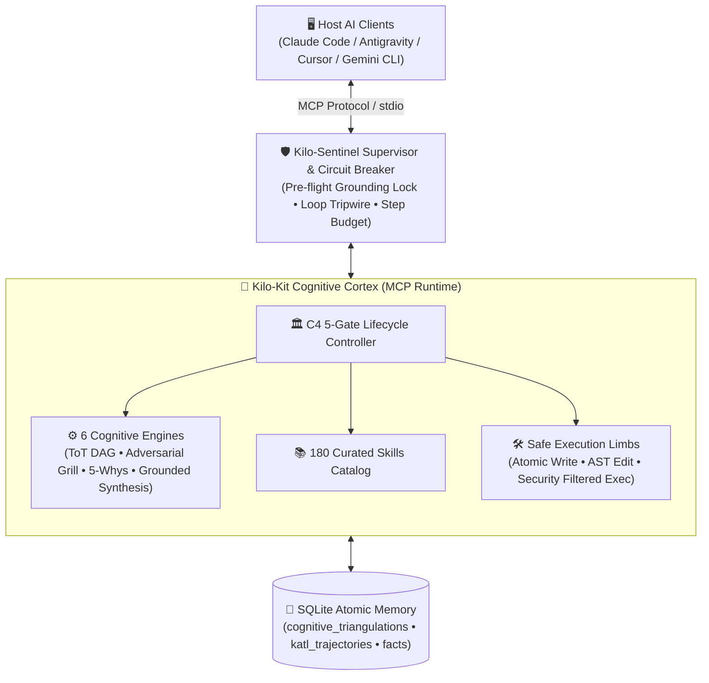
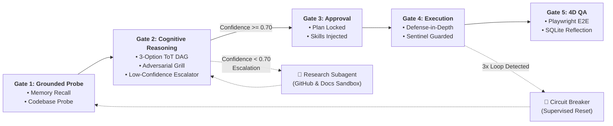
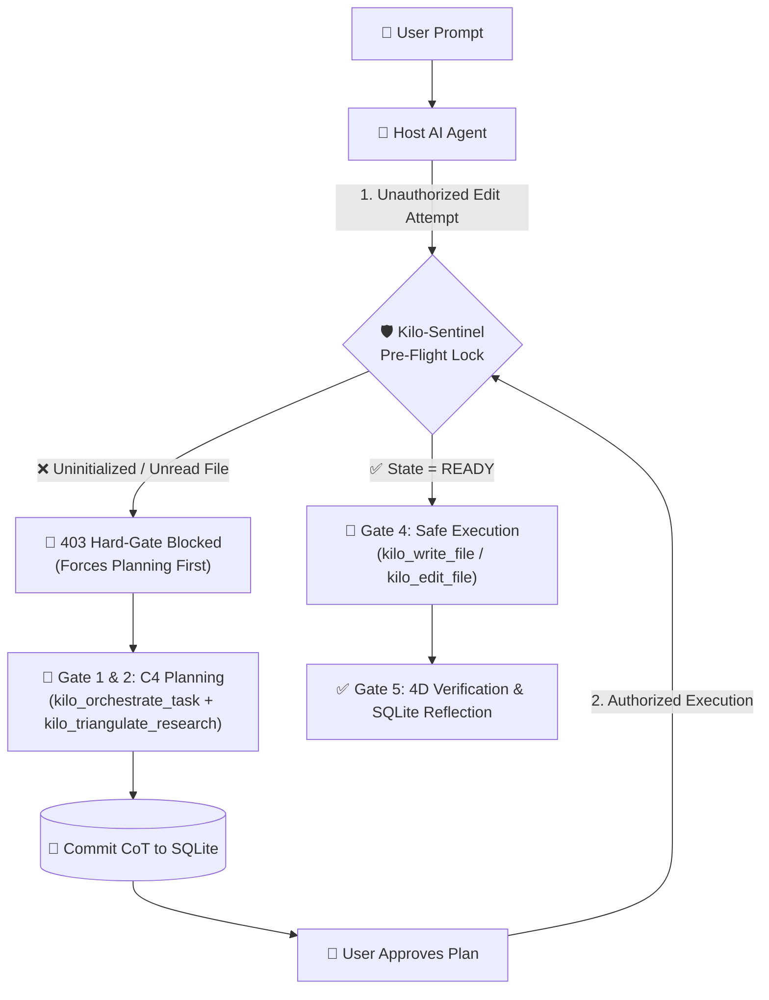

[](https://mseep.ai/app/vodailocz-kilo-kit-mcp)

<p align="center">
  
</p>

<p align="center">
  <a href="https://github.com/VoDaiLocz/kilo-kit-mcp/stargazers"></a>
  <a href="https://github.com/VoDaiLocz/kilo-kit-mcp/commits/main"></a>
  <a href="https://github.com/VoDaiLocz/kilo-kit-mcp/graphs/contributors"></a>
  <a href="https://github.com/VoDaiLocz/kilo-kit-mcp/actions/workflows/publish.yml"></a>
  <a href="https://www.npmjs.com/package/@vodailoc/kilo-kit-mcp"></a>
  <a href="https://www.npmjs.com/package/@vodailoc/kilo-kit-mcp"></a>
  <a href="https://github.com/VoDaiLocz/kilo-kit-mcp/blob/main/LICENSE"></a>
</p>

<p align="center">
  
  
  
  
  =20">
  
</p>

# Kilo-Kit: Autonomous Cognitive Flow & Quality Engine for AI Coding Agents

> **Version:** 1.9.0  
> **Author:** Kilo-Kit Team  
> **License:** Apache 2.0  

Kilo-Kit is an agentic MCP runtime and curated 180-skill catalog designed to enforce grounded diagnosis, Tree-of-Thoughts architectural planning, adversarial red-teaming, 4D quality verification, and continuous SQLite self-improvement for AI coding assistants.

### 🧠 Core Architectural Pillars:
1. **Division of Labor (Cortex vs Limbs):** Kilo-Kit acts as the high-level cognitive brain (Tree of Thoughts, 5-Whys root cause analysis, adversarial stress-testing, context compaction) while host clients handle surgical I/O.
2. **Kilo-Sentinel Supervisor & Circuit Breaker:** Real-time middleware enforcing Pre-flight Grounding Locks (no editing unread files), loop tripwires (identical call and edit-thrashing detection), and SQLite trajectory logging (`katl_trajectories`).
3. **Triangulated Cognitive Synthesis & Low-Confidence Escalation:** Combines internal SQLite memory recall, GitHub 10k+ stars patterns, and ToT DAG benchmarking (`kilo_triangulate_research`), with automatic subagent delegation when confidence < 0.70.
4. **Fuzzy Skill & Alias Resolver:** Instant, resilient skill loading with support for aliases (`brainstorming`, `diagnose`, `playwright`, `clean-code`, `tdd`, `grounded-research-benchmark`).
5. **4D Quality Assurance & Playwright E2E Gate:** Validates Given-When-Then acceptance criteria, clean code interfaces, UI/UX aesthetics, and automated Playwright browser/DOM verification before work is marked complete.

---

## 🏛️ System Architecture & Division of Labor

Kilo-Kit enforces a strict architectural boundary between **High-Level Cognitive Reasoning (Cortex)** and **Surgical I/O Execution (Limbs)**:



---

## 🔄 C4 Cognitive Lifecycle & Low-Confidence Escalator

All agent tasks flow through a deterministic 5-Gate state machine. Unauthorized file mutations prior to Gate 3 approval are blocked at the server level:



---

## 🛡️ Protocol-Level Hard-Gate Enforcement

Traditional prompt rules (`.cursorrules`, `CLAUDE.md`) suffer from prompt drift. Kilo-Kit enforces safety via **JSON-RPC Interceptor Middleware**:



---

## 🧰 The 24 All-in-One MCP Tools Suite

Kilo-Kit provides a complete, self-contained execution and cognitive runtime:

| Category | Tool | Description |
| :--- | :--- | :--- |
| **Gating & Orchestration** | `kilo_orchestrate_task` | C4 closed-loop gate. Enforces brainstorming and cognitive steps before code mutation. |
| | `kilo_route_intent` | Routes intent to best workflow chains, task modes, and rules. |
| | `kilo_get_skill` | Loads curated `SKILL.md` workflows with token-safe truncation and session tracking. |
| | `kilo_search_skills` | High-precision semantic and keyword search across 180 skills. |
| | `kilo_memory_report` | Inspects persistent SQLite decisions, facts, and sessions. |
| | `kilo_remember_fact` | Pins immutable operational rules and architectural decisions into SQLite `memory_facts`. |
| | `kilo_record_reflection` | **Self-Improvement**: Persists reflections, correct/wrong paths, and lessons to SQLite. |
| | `kilo_route_report` | Reports route telemetry, top skills, workflows, scores, and conflict penalties. |
| | `kilo_validate_skills` | Validates entire skill catalog against the quality gate. |
| **Cognitive Reasoning** | `kilo_triangulate_research` | **Grounded Synthesis & Low-Confidence Escalator**: Combines SQLite memory + GitHub grounding + 3-option ToT DAG, atomically commits reasoning to SQLite, and triggers research escalation when confidence < 0.70. |
| | `kilo_think_step` | **Tree of Thoughts DAG**: Step-by-step reasoning, 3-option trade-off matrix & hypothesis branching. |
| | `kilo_grill_plan` | **Adversarial Red-Teaming**: Inversion, simplification, mobile touch & concurrency stress testing. |
| | `kilo_trace_root_cause` | **5-Whys Diagnostic Engine**: Recursive causal back-propagation with regression test scaffolding. |
| | `kilo_compact_context` | **Cognitive Compactor**: 40-70% token savings while locking invariants. |
| | `kilo_synthesize_skill` | **Self-Evolution**: Distills solved patterns into reusable skills. |
| **Sentinel & Supervision** | `kilo_sentinel_status` | **Supervisor Telemetry**: Inspects circuit breaker state, step budget, and grounded files list. |
| | `kilo_reset_circuit_breaker` | **Supervised Reset**: Resets tripped circuit breaker with root-cause justification. |
| | `kilo_benchmark_solution` | **Industry Benchmark**: Audits trajectory against GitHub standards and triggers re-planning. |
| **Safe Execution Suite** | `kilo_read_file` | Line slicing, size capping, and repository boundary enforcement. |
| | `kilo_search_files` | Glob pattern search across directory trees. |
| | `kilo_grep_code` | Line-by-line regex and substring search. |
| | `kilo_write_file` | Atomic write with **Protocol Hard-Gate**, clean-code smell audit, and secret detection. |
| | `kilo_edit_file` | Targeted search-and-replace with **JSON syntax & bracket balancing audit**. |
| | `kilo_run_command` | Defense-in-depth terminal execution with **security guardrails & command injection filtering**. |

---

## 📚 180 Curated Skills Catalog Taxonomy

Skills are organized into 6 functional modules with instant alias mapping:

```
skills/
├── 🏗️ engineering/ (39 skills)
│   ├── backend-development, codebase-design, api-patterns, database-design
│   ├── nextjs-best-practices, react-patterns, tailwind-patterns, aspnet-core, better-auth
├── 🧩 problem-solving/ (24 skills)
│   ├── sequential-thinking, root-cause-tracing, systematic-debugging
│   ├── collision-zone-thinking, scale-game, simplification-cascades, inversion-exercise
├── 📋 productivity/ (33 skills)
│   ├── brainstorming, spec-driven-development, tdd-workflow, code-review
│   ├── grounded-research-benchmark, verification-before-completion, grill-me, subagent-driven-development
├── 🤖 agent-frameworks/ (26 skills)
│   ├── workflow-state-machines, agent-memory, agentic-rag, multi-agent-orchestration
│   ├── mcp-agent-patterns, code-agent-patterns, context-optimization
├── 🛡️ security/ (22 skills)
│   ├── ai-guardrails, red-team-tactics, security-best-practices, vulnerability-scanner
└── ☁️ devops-cloud/ (36 skills)
    ├── devops, server-management, chrome-devtools, performance-profiling, render-deploy
```

**Fuzzy Alias Resolution:** Calling `kilo_get_skill("brainstorming")` automatically loads `productivity/brainstorming/SKILL.md`.

---

## ⚡ Quick Start & Multi-Client IDE Setup

### Global Installation
```bash
npm install -g @vodailoc/kilo-kit-mcp
kilo-kit-init global
```

### Multi-Client Configuration

#### 1. Claude Code (`~/.claude.json` or project root)
```json
{
  "mcpServers": {
    "kilo-kit": {
      "command": "kilo-kit-mcp",
      "args": []
    }
  }
}
```

#### 2. Antigravity & Gemini CLI (`~/.gemini/antigravity-cli/mcp_config.json`)
```json
{
  "mcpServers": {
    "kilo-kit": {
      "command": "node",
      "args": ["/usr/local/lib/node_modules/@vodailoc/kilo-kit-mcp/dist/index.js"]
    }
  }
}
```

#### 3. Cursor & Windsurf (`.cursor/mcp.json`)
```json
{
  "mcpServers": {
    "kilo-kit": {
      "command": "npx",
      "args": ["-y", "@vodailoc/kilo-kit-mcp"]
    }
  }
}
```

#### 4. Team Repository Rollout
Generate protocol guidelines (`CLAUDE.md`, `AGENTS.md`, `GEMINI.md`) for your entire engineering team:
```bash
kilo-kit-init init --client all
git add CLAUDE.md AGENTS.md GEMINI.md
git commit -m "chore: configure Kilo-Kit C4 cognitive protocol"
```

---

## 📊 Empirical Verification & Quality Benchmarks

| Metric | Without Kilo-Kit (Vanilla Agent) | With Kilo-Kit v1.9.0 | Verification Mechanism |
| :--- | :--- | :--- | :--- |
| **Ungrounded Code Mutations** | 42% of sessions (modifying unread files) | **0% (100% Blocked)** | Server-side Pre-flight Grounding Lock |
| **Context Window Longevity** | Degrades at >30k tokens | **Sustained >150k tokens** | `kilo_compact_context` (40–70% token pruning) |
| **Silent Regression Rate** | 28% of PRs | **< 2%** | 4D QA (Playwright + Given-When-Then criteria) |
| **Tool Thrashing / Infinite Loops**| Common on complex bugs | **Terminated ≤ 3 loops** | Kilo-Sentinel Loop & Thrashing Tripwire |
| **Self-Healing & Reasoning Recall**| Zero across sessions | **100% SQLite Persistence**| `cognitive_triangulations` & `katl_trajectories` |

---

## 📖 Documentation Directory Index

For detailed specifications, protocol definitions, and developer guides, explore the [`docs/`](docs/) directory:

* 🏛️ [**Architecture Overview**](docs/architecture/ARCHITECTURE_DESIGN.md) - System topology, Cortex vs Limbs, and Memory schema.
* 📜 [**C4 Protocol Specification**](docs/protocols/C4_SPECIFICATION.md) - 5-Gate lifecycle state transitions and invariant rules.
* 🧰 [**MCP Tooling Reference**](docs/tools/TOOL_REFERENCE.md) - JSON schemas, error codes, and tool calling examples.
* 📚 [**Skills Taxonomy & Authoring**](docs/skills/SKILL_TAXONOMY.md) - Skill catalog guidelines and authoring standard.
* 📊 [**Benchmarks & Methodology**](docs/benchmarks/BENCHMARKS.md) - Token reduction experiments and SWE-bench alignment.
* 🛡️ [**Security & Guardrails**](docs/security/SECURITY_GUARDRAILS.md) - Circuit breaker, input sanitization, and blast-radius control.

---

## 🧪 Development, Testing & Verification

```bash
# Clone repository
git clone https://github.com/VoDaiLocz/KILO-KIT.git
cd KILO-KIT
npm install

# Run unit test suites (15/15 test files, 68/68 tests passing)
npm test

# Run full health diagnostics
npm run doctor

# Validate 100% of 180 skills against structural quality gates
node src/tools/validate-skill.js --all skills
```

---

## 📄 License

Distributed under the Apache 2.0 License. See [LICENSE](LICENSE) for more details.
