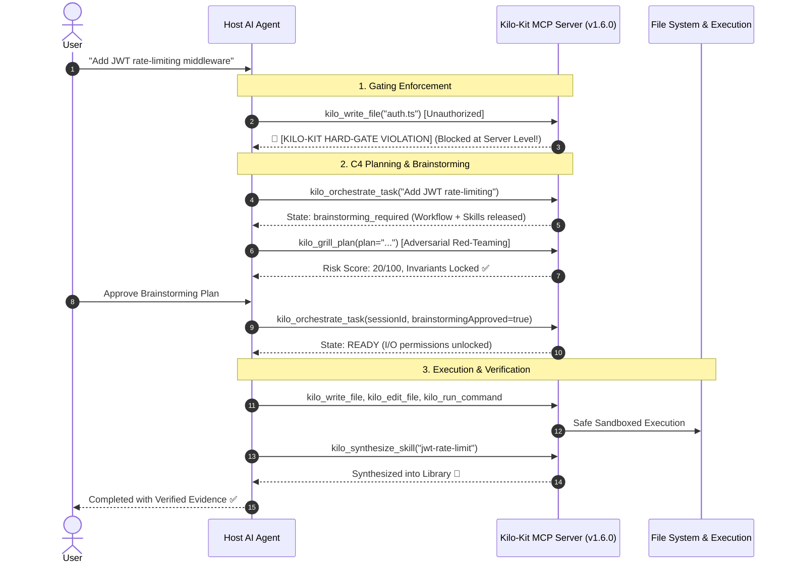

[](https://mseep.ai/app/vodailocz-kilo-kit-mcp)

<p align="center">
  
</p>

<p align="center">
  <a href="https://github.com/VoDaiLocz/KILO-KIT/stargazers"></a>
  <a href="https://github.com/VoDaiLocz/KILO-KIT/commits/main"></a>
  <a href="https://github.com/VoDaiLocz/KILO-KIT/graphs/contributors"></a>
  <a href="https://github.com/VoDaiLocz/KILO-KIT/actions/workflows/publish.yml"></a>
  <a href="https://www.npmjs.com/package/@vodailoc/kilo-kit-mcp"></a>
  <a href="https://www.npmjs.com/package/@vodailoc/kilo-kit-mcp"></a>
  <a href="LICENSE"></a>
</p>

<p align="center">
  
  
  
  
  =20">
  
</p>

# Kilo-Kit: MCP Workflow Gates for Coding Agents

> **Version:** 1.6.0  
> **Author:** Kilo-Kit Team  
> **License:** Apache 2.0  

Kilo-Kit is a local-first MCP server and skill library for making coding agents follow safer, repeatable workflows before they touch code.

Use it when your agent skips planning, ignores project workflow rules, forgets useful context, or claims work is done before verification.

It packages a curated `skills/` library, an MCP server, and a C4 workflow gate that turns a user request into an auditable loop:

```text
request -> route -> planning gate -> memory check -> workflow release -> verification gate
```

The published package is `@vodailoc/kilo-kit-mcp`.

---

## ⚡ 1-Click Quick Setup (Universal AI Client Support)

Choose the setup method that best fits your workflow:

### Option A: Universal Auto-Installer (Recommended)
Run the auto-configurator in your terminal. It automatically detects and configures **Antigravity CLI, Cursor IDE, Windsurf, Claude Code, and Claude Desktop** in 1 second:

```bash
npx -y @vodailoc/kilo-kit-mcp setup
```

### Option B: Claude Code CLI
Add Kilo-Kit directly to Claude Code with a single command:

```bash
claude mcp add kilo-kit -- npx -y @vodailoc/kilo-kit-mcp
```

### Option C: Manual MCP Configuration (`mcpServers`)
Add the following JSON block to your AI client's configuration file (e.g. `~/.cursor/mcp.json`, `~/.gemini/antigravity-cli/mcp_config.json`, or `claude_desktop_config.json`):

```json
{
  "mcpServers": {
    "kilo-kit": {
      "command": "npx",
      "args": ["-y", "@vodailoc/kilo-kit-mcp"]
    }
  }
}
```

---

## 🛡️ Why Kilo-Kit: Protocol-Level Server-Side Hard-Gate

Traditional agent systems rely entirely on passive text prompts (`.cursorrules` or `CLAUDE.md`). When LLMs experience prompt drift, they frequently skip planning, jump straight into rewriting code, introduce breaking changes, or hallucinate completion.

**Kilo-Kit solves this at the I/O Protocol layer:**



---

## 🧰 The 18 All-in-One MCP Tools Suite

Kilo-Kit provides a complete, self-contained execution and reasoning runtime:

| Category | Tool | Description |
| :--- | :--- | :--- |
| **Gating & Orchestration** | `kilo_orchestrate_task` | C4 closed-loop gate. Enforces brainstorming before code mutation. |
| | `kilo_route_intent` | Routes intent to best workflow chains, task modes, and rules. |
| | `kilo_get_skill` | Loads curated `SKILL.md` workflows with token-safe truncation. |
| | `kilo_search_skills` | High-precision semantic and keyword search across 177 skills. |
| | `kilo_memory_report` | Inspects persistent SQLite decisions, facts, and sessions. |
| | `kilo_route_report` | Reports route analytics, telemetry, and workflow metrics. |
| | `kilo_validate_skills` | Validates entire skill catalog against the quality gate. |
| **Safe Execution Suite** | `kilo_read_file` | Line slicing, size capping, and repository boundary enforcement. |
| | `kilo_search_files` | Glob pattern search across directory trees. |
| | `kilo_grep_code` | Line-by-line regex and substring search. |
| | `kilo_write_file` | Atomic directory write with **Protocol Hard-Gate check**. |
| | `kilo_edit_file` | Targeted search-and-replace with **AST syntax validation**. |
| | `kilo_run_command` | Sandboxed terminal execution with **security guardrails**. |
| **Cognitive Reasoning** | `kilo_think_step` | **Tree of Thoughts DAG**: Step-by-step reasoning & hypothesis branching. |
| | `kilo_grill_plan` | **Adversarial Red-Teaming**: Inversion, simplification & blast radius. |
| | `kilo_trace_root_cause` | **5-Whys Diagnostic Engine**: Recursive causal back-propagation. |
| | `kilo_compact_context` | **Cognitive Compactor**: 40-70% token savings while locking invariants. |
| | `kilo_synthesize_skill` | **Self-Evolution**: Distills solved patterns into reusable skills. |

---

## 🧠 Cognitive Thinking & Reasoning Engines

### 1. `kilo_think_step` (Tree of Thoughts)
Allows agents to record iterative hypotheses, branch into alternative solutions (`branchId`), and backtrack when initial assumptions fail.

### 2. `kilo_grill_plan` (Adversarial Red-Teaming)
Stress-tests architectures against 3 critical lenses:
* **Inversion Analysis:** *Where will this fail first under 100x traffic or network timeouts?*
* **Simplification Cascade:** *Can 50% of this complexity be deleted?*
* **Blast Radius:** *Will mutating this state cause regressions in unrelated modules?*

### 3. `kilo_trace_root_cause` (5-Whys Root Cause Tracer)
Bypasses superficial patches by propagating backward from crash stack traces to the true systemic trigger:
$$\text{Stack Trace} \xrightarrow{\text{Why?}} \text{Null Pointer} \xrightarrow{\text{Why?}} \text{Un-awaited Promise} \xrightarrow{\text{Root Cause}} \text{Bootstrap Lifecycle Race!}$$

### 4. `kilo_compact_context` (Token Economy)
Slashes context bloat by compressing repetitive terminal logs while anchoring architectural invariants (`[INVARIANT]`) into active working memory.

### 5. `kilo_synthesize_skill` (Self-Evolving Agent)
Transforms solved production bugs and clean designs into standardized `SKILL.md` entries that persist across future coding sessions.

---

## 📚 177 Curated Skills Catalog

Kilo-Kit bundles 177 production-ready skills categorized into:

* **Engineering & Architecture:** `codebase-design`, `backend-development`, `api-patterns`, `database-design`, `nextjs-best-practices`, `react-patterns`, `tailwind-patterns`, `aspnet-core`, `better-auth`.
* **Problem-Solving & Reasoning:** `sequential-thinking`, `root-cause-tracing`, `systematic-debugging`, `collision-zone-thinking`, `scale-game`, `simplification-cascades`, `inversion-exercise`.
* **Productivity & Review:** `brainstorming`, `spec-driven-development`, `tdd-workflow`, `code-review`, `verification-before-completion`, `grill-me`, `subagent-driven-development`.
* **Agent Frameworks:** `workflow-state-machines`, `agent-memory`, `agentic-rag`, `multi-agent-orchestration`, `mcp-agent-patterns`.
* **Security & Defense:** `ai-guardrails`, `red-team-tactics`, `security-best-practices`, `vulnerability-scanner`.
* **Operations & Cloud:** `docker-devops`, `server-management`, `chrome-devtools`, `performance-profiling`.

---

## ⚙️ Workspace Bootstrapping (Optional Multi-Agent Fallback)

In MCP-integrated environments (like Antigravity CLI, Cursor, Claude Code), Kilo-Kit **requires zero `.md` files in project repos**.

If you share a repository with external team members using standalone LLM clients without global MCP, you can bootstrap standard markdown instruction blocks:

```bash
# Bootstrap C4 rules for all major AI clients in target project
kilo-kit-init init --client all --dir /path/to/project
```

Generates idempotent C4 hooks in:
* `GEMINI.md` (Gemini CLI / Antigravity)
* `AGENTS.md` (OpenAI Codex)
* `CLAUDE.md` (Claude Code)

---

## 🧪 Verification & Development

```bash
# Clone and install dependencies
git clone https://github.com/VoDaiLocz/KILO-KIT.git
cd KILO-KIT
npm install

# Run unit tests (50/50 test suites across 12 files)
npm test

# Run skill catalog validation (177/177 skills)
node src/tools/validate-skill.js --all skills

# Full prepublish test & smoke verification
npm run prepublishOnly
```

---

## 📄 License

Distributed under the Apache 2.0 License. See [LICENSE](LICENSE) for more details.
