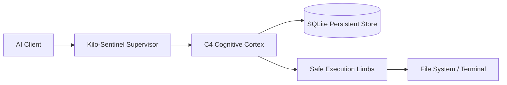

# 🏛️ Kilo-Kit System Architecture Design

## 1. System Topology & Separation of Concerns
Kilo-Kit strictly enforces the **Division of Labor (Vỏ não vs Chân tay)**:
- **Cortex (Kilo-Kit MCP Server):** High-level cognitive reasoning, Tree-of-Thoughts DAG planning, adversarial red-teaming, 5-Whys root cause tracing, semantic context compaction, and SQLite memory persistence.
- **Sentinel Supervisor (Kilo-Sentinel):** State machine enforcement, pre-flight grounding lock, loop and edit-thrashing tripwires, and step budget management.
- **Limbs (Safe Execution Tools):** Atomic file writing, syntax-balanced editing, security-filtered terminal execution.

## 2. SQLite Persistent Memory Topology
Database: `~/.kilo-kit/orchestrator.sqlite`
- **`cognitive_triangulations`**: Stores full ToT DAG options (A, B, C), chosen rationale, and confidence scores.
- **`katl_trajectories`**: Append-only step-by-step telemetry of every MCP tool call with duration, verdict, and result summary.
- **`memory_facts`**: Long-term operating rules and architectural constraints.
- **`learning_reflections`**: Self-improvement lessons and avoided anti-patterns.
