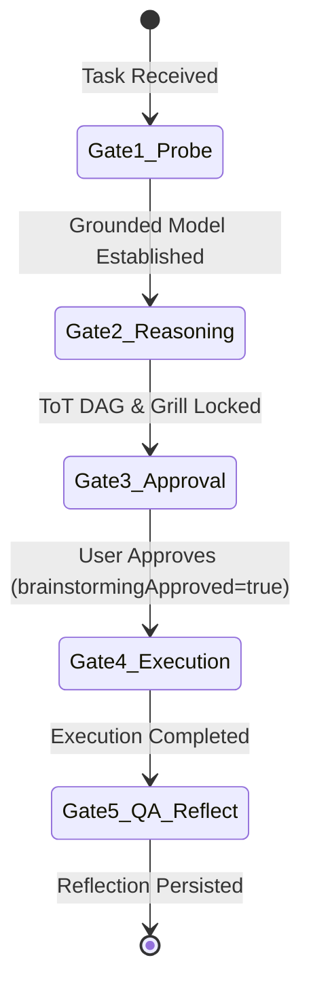

# 📜 Kilo-Kit C4 v3.0 Cognitive Protocol Specification

## 1. Abstract & Scope
The C4 Cognitive Protocol establishes an unskippable 5-gate lifecycle for autonomous coding agents, eliminating superficial one-liner planning and ungrounded code modifications.

## 2. The 5-Gate State Machine

### Gate 1: Hard-Gate & Grounded Probe
- Agent calls `kilo_orchestrate_task` to initialize session and retrieve relevant SQLite memory suggestions.
- Agent performs read-only exploratory probing (`kilo_read_file`, `kilo_grep_code`) before modifying code.

### Gate 2: Substantive Cognitive Reasoning & Triangulation
- **Features / Architecture:** Must call `kilo_triangulate_research` (3-option DAG comparison) and `kilo_grill_plan` (Adversarial Red-Team). If confidence < 0.70, research escalation is triggered.
- **Bugs / Regressions:** Must call `kilo_trace_root_cause` (5-Whys back-propagation).
- **Context Overload:** Call `kilo_compact_context` when >4 files are read to lock invariants.

### Gate 3: Approval & Skill Delivery
- Call `kilo_orchestrate_task` with `brainstormingApproved=true` and valid `sessionId`.
- Load required workflow skills via `kilo_get_skill`.

### Gate 4: Surgical Implementation & Defense-in-Depth
- Apply 3-layer validation (Input, Logic, Persistence).
- Maintain clean-code standards with zero dead code or debug bloat.

### Gate 5: 4D Quality Assurance & Self-Reflection
- **Dimension 1 (Spec Fidelity):** Given-When-Then verification.
- **Dimension 2 (Clean Code):** Deep module interfaces.
- **Dimension 3 (UX & Aesthetics):** Responsive layout and touch safety.
- **Dimension 4 (Empirical & Playwright):** Run compile/build and real tests.
- **Continuous Reflection:** Call `kilo_record_reflection` to save lessons to SQLite.
